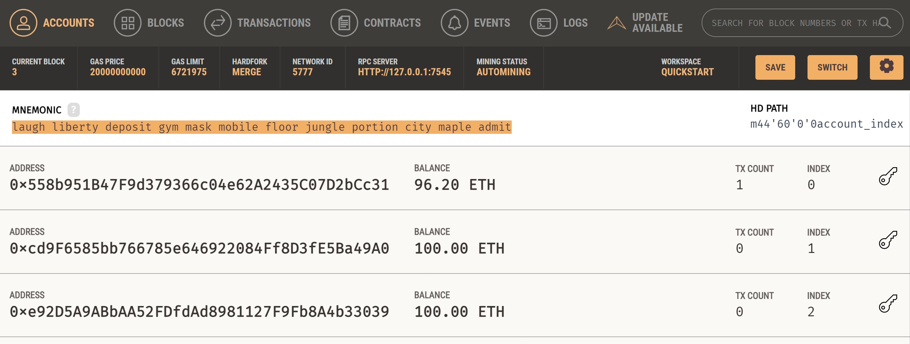
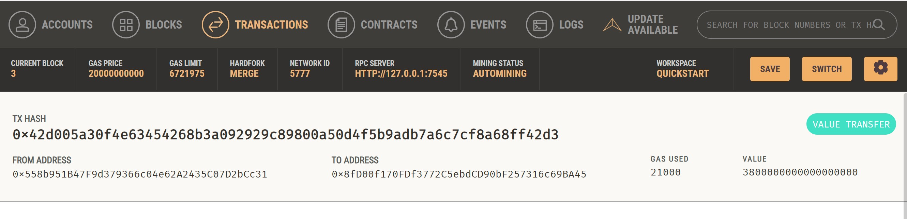

# Module_19_Challenge

The name of this application is Fintech Finder. Customers can use this app to find fintech professionals from among a list of candidates, hire them, and pay them.

---

## Technologies

This project levereges python 3.9 with the following packages:

* [Streamlit](https://streamlit.io/)
* [Dataclasses](https://docs.python.org/3/library/dataclasses.html) 
* [Typing](https://docs.python.org/3.6/library/typing.html) 
* [Web3](https://web3py.readthedocs.io/en/stable/overview.html)
* [Bip44](https://pypi.org/project/bip44/)
* [Mnemonic](https://pypi.org/project/mnemonic/)
* [Ganache](https://trufflesuite.com/ganache/)

---

## Usage

To use the application clone the repository, open up a new terminal, navigate to the respective folder, and run the Streamlit application by using: `streamlit run fintech_finder.py`

---

## Ganache Screenshots

**Address Balance and History**

**Transaction**

---

## Contributors

Created by Maximus Accurso

---

## License

None
